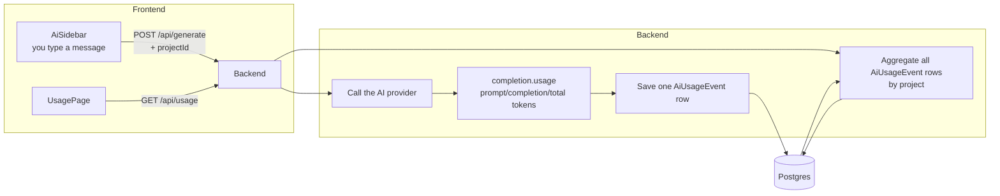
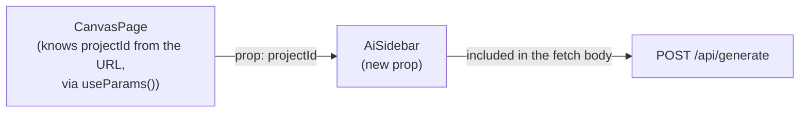
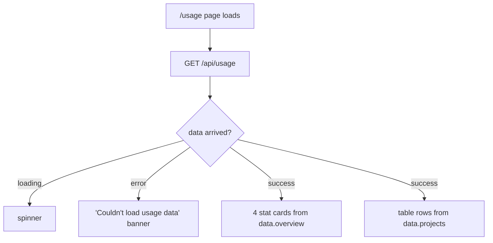

# AI Token Usage Tracking — how it works

This document explains, end to end, the "Usage" feature that tracks how many AI tokens
ArchForge is spending — per AI call, per project, and in total. It covers *what* was
built, *why* each piece works the way it does, and walks through the exact code so you
can trace a single button click all the way through the system.

## 1. The problem this solves

ArchForge calls an LLM every time you send a message in the AI sidebar
(`POST /api/generate`). Every one of those calls costs tokens — some spent on your
message, some spent on the model's reply. Before this feature existed, that cost was
completely invisible: the backend asked the AI provider for a completion, read the
reply text out of it, and **threw away** the token-count information the provider sent
back alongside it. There was no record anywhere of how much any of it cost, which
project was burning the most tokens, or whether a single "hi" was cheap or expensive.

This feature adds a permanent record of that cost and a page to view it.

## 2. The big picture

Three things had to happen:

1. **Capture** — every time the backend calls the AI provider, record how many tokens
   that specific call used, and *which project* it belongs to.
2. **Store** — save that record permanently in the database (not just in memory), so it
   survives restarts and accumulates over time.
3. **Show** — a new page in the app that reads all those records back and displays
   totals, both overall and broken down per project.



## 3. The database: one row per AI call

**File: `apps/backend/prisma/schema.prisma`**

```prisma
model Project {
  id           String         @id @default(cuid())
  title        String
  state        Bytes?
  createdAt    DateTime       @default(now())
  updatedAt    DateTime       @updatedAt
  usageEvents  AiUsageEvent[]
}

model AiUsageEvent {
  id               String   @id @default(cuid())
  projectId        String
  project          Project  @relation(fields: [projectId], references: [id], onDelete: Cascade)
  promptTokens     Int
  completionTokens Int
  totalTokens      Int
  model            String
  createdAt        DateTime @default(now())
}
```

Think of `AiUsageEvent` as a receipt. Every single call to the AI creates exactly one
receipt: how many tokens went in (`promptTokens`), how many came out
(`completionTokens`), the sum (`totalTokens`), which model answered, when, and for
which project. Nothing ever updates a row after it's written — they just pile up, and
the Usage page adds them up on the fly. That's the whole "database design": an
append-only log, not a running counter.

**Why `onDelete: Cascade`?** If you delete a project, its usage rows have no reason to
exist any more — cascading means Postgres deletes them automatically in the same
transaction as the project, so you never end up with orphaned receipts for a project
that no longer exists. This was verified directly: deleting a test project during
development instantly zeroed out its usage from `/api/usage`, with no manual cleanup
needed.

## 4. Capturing usage — the moment it happens

**File: `apps/backend/src/routes/ai.ts`**, inside the `/api/generate` route handler.

The AI call itself looks like this (nothing new here — this already existed):

```ts
const completion = await getClient().chat.completions.create({
  model: MODEL,
  temperature: 0.3,
  max_tokens: MAX_COMPLETION_TOKENS,
  messages: [
    { role: "system", content: buildSystemPrompt(allowClarify, graph) },
    ...conversation,
  ],
});

const raw = completion.choices[0]?.message?.content ?? "";
```

Right after that, and **before** anything else happens with the response, we grab the
usage numbers and save them:

```ts
const projectId = readProjectId(req.body);
if (projectId && completion.usage) {
  try {
    await prisma.aiUsageEvent.create({
      data: {
        projectId,
        promptTokens: completion.usage.prompt_tokens,
        completionTokens: completion.usage.completion_tokens,
        totalTokens: completion.usage.total_tokens,
        model: MODEL,
      },
    });
  } catch (err) {
    console.error("AI generate: failed to record token usage:", err);
  }
}
```

Every OpenAI-compatible API response includes a `usage` object with
`prompt_tokens` / `completion_tokens` / `total_tokens` — this was always being sent
back by the provider, it just wasn't being read. This code is the entire fix: read it,
save it.

A few deliberate choices here, each for a real reason:

- **It happens before the response is parsed or validated.** The code above runs
  *before* the block that checks whether the model said `"reply"`, `"ask"`, or
  `"generate"`, and before the JSON is even parsed. That means usage gets recorded for
  **every** kind of turn — including a plain "hi" that gets a `reply` action, and even
  a response that fails to parse as JSON at all. All of those still cost real tokens,
  so all of them get a receipt. If usage capture were bolted on further down (say,
  only inside the "generate" branch), turns like small talk would silently vanish from
  the numbers even though they're a large chunk of real spend.

- **It's wrapped in its own `try/catch` that only logs.** If the database write fails
  for any reason (DB down, network blip), that failure is swallowed and just logged —
  it never reaches the user, and it never changes what `/api/generate` returns. This
  matters a lot in this codebase specifically: `GenerateResponse` is a strict contract
  the frontend depends on (see `packages/shared/src/clarify.ts`), and the project's own
  rules say a database hiccup must never turn into a broken AI reply. There's a test
  that proves this exact behavior (`apps/backend/src/routes/ai-usage.test.ts` — "still
  returns a normal response when the usage DB write fails").

- **`projectId` has to come from somewhere.** The backend has always been
  *stateless* — it doesn't know which project a request belongs to unless the request
  tells it. So a new optional field was added to the request body:

  ```ts
  // packages/shared/src/clarify.ts
  export interface GenerateRequest {
    messages: AiChatTurn[];
    graph: SerializedGraph;
    projectId?: string;
  }
  ```

  And a small defensive reader next to the existing ones (`readGraph`,
  `readConversation`) pulls it out of the untrusted request body:

  ```ts
  export function readProjectId(body: unknown): string | null {
    const { projectId } = (body ?? {}) as { projectId?: unknown };
    return typeof projectId === "string" && projectId.trim() ? projectId.trim() : null;
  }
  ```

  If `projectId` is missing (e.g. someone calls the API directly without it), the
  `if (projectId && completion.usage)` check just skips recording — the AI call still
  works normally, it simply isn't attributed to any project.

## 5. Getting `projectId` from the browser to the request

The AI call happens in `AiSidebar.tsx`, but that component didn't know which project
it was running in — the page around it did. So `projectId` gets threaded down one
level:



```ts
// apps/frontend/src/pages/CanvasPage.tsx
const { projectId = "" } = useParams();
...
<AiSidebar projectId={projectId} ... />
```

```ts
// apps/frontend/src/components/AiSidebar.tsx
body: JSON.stringify({
  messages: history,
  graph: readGraphForAi(),
  projectId,
} satisfies GenerateRequest),
```

That's the entire wiring — one new prop, one new field in the request body.

## 6. Reading usage back — `GET /api/usage`

**File: `apps/backend/src/routes/usage.ts`**

This endpoint answers "how much have we spent, and on what?" It does two database
queries and stitches the results together:

```ts
const grouped = await prisma.aiUsageEvent.groupBy({
  by: ["projectId"],
  _sum: { promptTokens: true, completionTokens: true, totalTokens: true },
  _count: true,
});

const projects = await prisma.project.findMany({
  where: { id: { in: grouped.map((g) => g.projectId) } },
  select: { id: true, title: true },
});
```

Step by step, in plain words:

1. **`groupBy`** — take every `AiUsageEvent` row, bucket them by `projectId`, and for
   each bucket sum up the token columns and count how many rows fell into it. This is
   one SQL `GROUP BY` query — the database does the adding-up, not our code. The
   result is a list like
   `[{ projectId: "abc", _sum: { promptTokens: 8692, ... }, _count: 2 }, ...]`.

2. **`findMany`** — `AiUsageEvent` only stores a `projectId`, not a project *name*.
   This second query fetches the human-readable `title` for exactly the projects that
   showed up in the grouped results (nothing more), and builds a quick lookup map
   (`titleById`) to attach titles in the next step.

3. **Merge and total** — loop over the grouped buckets once, and while building each
   project's row (`{ projectId, title, promptTokens, completionTokens, totalTokens,
   callCount }`), add its numbers into a running `overview` total at the same time.
   One pass does both jobs — no separate query needed for the site-wide totals.

4. **Sort** — the project list is sorted by `totalTokens`, highest first, so the
   heaviest-spending project is always at the top of the table.

The response shape (shared between backend and frontend so both sides agree on it) is
defined once in `packages/shared/src/usage.ts`:

```ts
export interface UsageTotals {
  promptTokens: number;
  completionTokens: number;
  totalTokens: number;
  callCount: number;
}

export interface ProjectUsage extends UsageTotals {
  projectId: string;
  title: string;
}

export interface UsageResponse {
  overview: UsageTotals;
  projects: ProjectUsage[];
}
```

## 7. The Usage page

**File: `apps/frontend/src/pages/UsagePage.tsx`**, reachable via a new "Usage" entry in
the left sidebar (`apps/frontend/src/components/PrivateLayout.tsx`) and routed at
`/usage` (`apps/frontend/src/App.tsx`).

It's a plain React Query fetch — no local state, no polling, just "load once when the
page opens":

```ts
const { data, isLoading, isError } = useQuery({
  queryKey: ["usage"],
  queryFn: getUsage,
});
```

`getUsage()` (`apps/frontend/src/lib/api.ts`) is a one-line `fetch("/api/usage")`
wrapper, matching the same pattern every other API call in this app already uses.

What it renders:

- **Four stat cards** at the top — Total tokens, Input tokens, Output tokens, AI
  calls — pulled straight from `data.overview`.
- **A "By project" table** below — one row per project with usage recorded, showing
  calls / input / output / total, already sorted heaviest-first by the backend.
  Clicking a row navigates to that project's canvas, the same way project cards do
  everywhere else in the app.



## 8. Walking through one real message, start to finish

Say you open a project and type "hi":

1. **`AiSidebar`** builds the request body: your message, the current canvas, and the
   project's id — and `POST`s it to `/api/generate`.
2. **`/api/generate`** builds the (large) system prompt, appends your conversation,
   and calls the AI provider.
3. The provider replies with both the answer **and** a `usage` object —
   e.g. `{ prompt_tokens: 4139, completion_tokens: 104, total_tokens: 4243 }`.
4. The backend immediately writes one `AiUsageEvent` row with those exact numbers,
   tagged with your `projectId`.
5. Separately (unrelated to usage — this was already how the app worked), the backend
   decides this was a `reply` turn (just small talk), and sends back a short answer —
   your usage row was already saved by this point, regardless of what kind of reply it
   turned out to be.
6. Next time you open `/usage`, `GET /api/usage` groups every row (including the one
   from step 4) by project, sums them, and the page shows the updated totals.

That "4,139 input tokens for just 'hi'" number is real and correct — it isn't the word
"hi" costing that much, it's the **fixed system prompt** (the full set of instructions
the model is given on every single call, roughly 4,000+ tokens on its own) dominating
the cost of a short message. The tracking feature is doing its job by surfacing that.

## 9. Tests

- **`apps/backend/src/routes/usage.test.ts`** — tests the `/api/usage` aggregation
  logic in isolation, with the database mocked out. Covers: totals sum correctly and
  sort order is right; an empty database returns all-zero totals instead of crashing;
  a usage row with no matching project (shouldn't normally happen, given the cascade
  delete) falls back to a safe placeholder title instead of breaking.

- **`apps/backend/src/routes/ai-usage.test.ts`** — tests the *recording* side, through
  a real HTTP call into the actual `/api/generate` route (with the AI provider and the
  database both mocked): a usage row gets created when `projectId` is present, no row
  is created when it's missing, and — the most important one — the endpoint still
  returns a normal 200 response even if the database write throws an error.

*A small aside on that last test*: while writing it, a real Vitest quirk showed up —
resetting the same mock inside a shared `beforeEach` (instead of at the start of each
test) caused a *different* test in the file to get blamed for an error that had
nothing to do with it, even though the application code itself was already handling
that error correctly. The fix was mechanical (reset each mock inline, inside the test
that needs it, not in a shared hook) and is called out with a comment in the test file
so it doesn't look like an accident later.

## 10. Design decisions — the "why" behind the shape of this feature

**Why not add `usage` straight onto `GenerateResponse`?**
`GenerateResponse` is a tightly-guarded contract — every field on it is typed and
required on every branch of the route, by design (see the comments in
`packages/shared/src/clarify.ts`). Usage tracking is a side effect that happens to the
*database*, not something the browser needs in that specific response. Keeping it
separate means a database hiccup can never touch what the AI sidebar receives, and the
Usage page can be read independently of any single chat turn.

**Why record usage for `reply`/`ask` turns, not just `generate`?**
Because they all cost tokens. A conversation full of "thanks", clarifying questions,
and small talk would otherwise look artificially cheap on the Usage page while still
costing real money.

**Why is `projectId` optional on the request instead of required?**
The route already accepts a legacy `{ prompt }`-only body with no project context
(used by older tests and any external caller). Making `projectId` required would have
meant breaking that, for no real benefit — a call with no project id just doesn't get
attributed, and everything else still works.

**Why `groupBy` in the database instead of loading every row and summing in
JavaScript?**
As usage rows grow into the thousands, `groupBy` stays a single fast SQL aggregate;
pulling every raw row over the network to sum in application code would get slower and
heavier over time for no benefit — the database is already good at this exact job.

**Why show raw token counts and not a dollar cost?**
There's no pricing configuration anywhere in this app today (providers are swapped via
one `.env` variable, each with different rates), so a dollar figure would have to be a
guess dressed up as a fact. Raw counts are the honest, verifiable number; a cost
estimate is a deliberately separate feature that wasn't built here.

## 11. What this feature does *not* do (yet)

- **No historical backfill.** Usage only starts accumulating from the moment this
  feature shipped — conversations that happened before that have no recorded usage,
  and the real token counts from those calls were never saved by the provider
  response at the time, so they can't be recovered exactly (only estimated, if that's
  ever built).
- **No cache-token breakdown.** The AI SDK does expose `cached_tokens` for
  providers that support prompt caching (OpenAI, sometimes Azure) — this was
  investigated but deliberately left out for now to keep this feature focused on the
  core input/output numbers.
- **It doesn't reduce token usage** — it only makes spend visible. Actually cutting
  the cost (e.g. not re-sending the entire conversation on every turn) is a separate,
  ongoing discussion.
